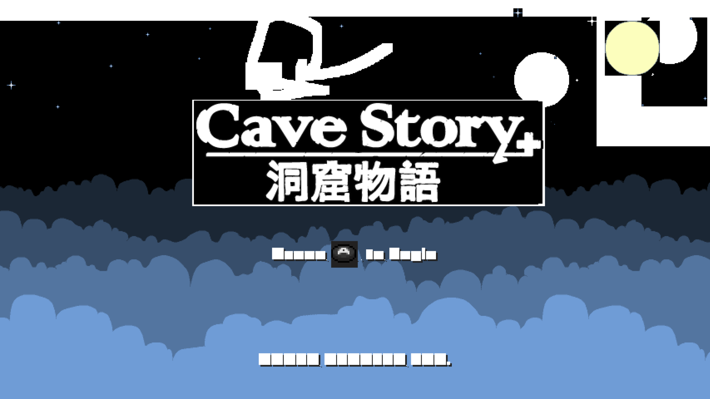

+++
date = "2018-04-15T01:18:00-05:00"
title = "First games are running!"
author = "jmc47"
forum = 15956
+++

A major milestone in yuzu has been reached, as it can now boot a handful of the Nintendo Switch's more primitive games.  Don't believe us?  Take a look!
<!--more-->

  

These changes are now available in the latest [yuzu canary builds](https://yuzu-emu.org/downloads/)!

Currently, only a few games are confirmed to boot, including:

* The Binding of Isaac: Afterbirth+
* Puyo Puyo Tetris
* Cave Story+

While these *may* not be the Switch titles that emulation hobbyists are looking forward to digging into, the fact that games are starting to work shows that yuzu is heading in the right direction.  That doesn't mean it wasn't a bumpy road to get here, though!

#### The Challenge Behind Booting Switch Games

Getting to this point hasn't been easy, and has been a massive reverse-engineering challenge.  Led by bunnei and Subv with contributions from ogniK and jroweboy the team slowly chipped away at stopping point after stopping point to finally get us to this milestone.  Special thanks to gdkchan and Ryujinx, as without collaboration, this wouldn't have been possible.

Also, huge thanks to Lioncash and MerryMage, who have been tirelessly working on the ARMv8 JIT that yuzu uses! Without it, we'd still be in the dark ages of interpreted CPU emulation.

While yuzu is built on top of Citra's kernel infrastructure, a lot of modification had to be done in order to move things over to the Switch's services.  But the main issues all had to do with the Switch's GPU.

Because it's a NVIDIA product, some information was able to be gleamed by sifting through the [Nouveau source](https://en.wikipedia.org/wiki/Nouveau_(software)).  Some of the more particularly difficult stopping points were Kernel Synchronization Primitives and Shader Decompilation, but there were many more smaller bumps along the way.  On top of that, the rest of the emulator had to be brought up to snuff in order to get games to the point where they would boot.

In the end, this is a small first step toward proper emulation of Nintendo's exciting console/handheld hybrid.  None of the games booting are especially stable and emulation is in a very, very early state.

#### What does yuzu Require?

Right now, most games won't run, and the games that do run will run incredibly slow and only get so far before encountering issues.  We recommend you have as fast of a processor as possible *and* a GPU that supports OpenGL 4.3 or newer.

  

    <figure class="image">
        
    </figure>
  

  

    <figure class="image">
        
    </figure>
  

  

    <figure class="image">
        
    </figure>
  

  

    <figure class="image">
        
    </figure>
  

#### What's next?
Currently, yuzu has two major development fronts that are ongoing: First, we are trying to get more games booting further, to the point that they are trying to render frames, and second, to try to emulate the Nvidia Maxwell GPU. Even for simple games such as these, Maxwell emulation has shown to be quite challenging - and we suspect that this will be our biggest focus in the coming months. As always, we welcome newcomers to join our team and help us toward these goals! If you're interested in contributing, please checkout our [Contributing Guide](http://localhost:3000/wiki/home/) or [join us on Discord](https://discord.gg/u77vRWY).