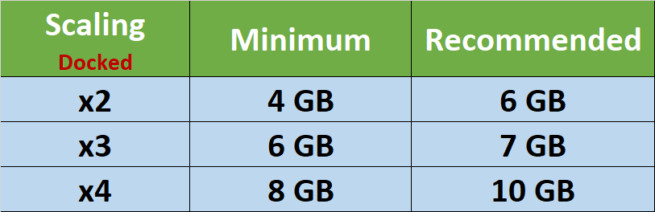

+++
date = "2021-10-24T07:12:00+05:30"
title = "New Feature Release - Resolution Scaler"
author = "CaptV0rt3x"
coauthor = "GoldenX86"
forum = 477883
+++

Hey there, yuz-ers!
For those of you eager to go beyond the limits of Switch hardware and experience the full potential of Switch games, the wait has finally ended.
Our most requested and anticipated feature — the **Resolution Scaler** — is finally here!

<!--more-->
&nbsp;

This new and massively improved **Resolution Scaler** is now available in the latest yuzu Early Access builds. 
We will be working diligently towards bringing this exciting new feature to our Mainline builds as soon as it's ready for a full release.

<article class="message is-danger">

<b>Latest Nvidia drivers are causing rendering issues with OpenGL. Please make sure to use the last known good driver: 472.12</b>

</article>

<article class="message is-warning">

<b>All following images have large file sizes when expanded. Please consider if on a Metered Connection.</b>

</article>

## What is Resolution Scaler?

Resolution Scaler is a new yuzu feature, which scales the dimensions of textures that Switch games render to, and then renders the games at the scaled resolution.
This allows games that were designed to render at lower resolutions (720p/900p/1080p), to go far beyond what was intended and be played at much higher resolutions (2K/4K/8K) in the same window!

The massive undertaking to reimplement this complex feature was only possible thanks to the combined efforts of our talented developers [**Blinkhawk**](https://github.com/FernandoS27), [**BreadFish**](https://github.com/breadfish64), [**epicboy**](https://github.com/ameerj), and [**Rodrigo**](https://github.com/reinuseslisp). 

&nbsp;


## Old Scaler

Blinkhawk implemented the original Resolution Scaler back in July of 2019.
However, the approach he took to achieve that was a bit different.
It was inspired by [**Cemu's**](https://cemu.info/) graphic packs, but rather than having a manual graphics pack developed for each title, it would automatically generate scaling profiles as the user played.

The generation algorithm used a database that recorded texture types and whether they were scalable or not.
The database was initially empty and, as the game ran, the algorithm would keep learning which textures to scale and which not to.
This approach was necessary, because of how yuzu was initially designed.

Originally, yuzu's memory reads were `reactive` — meaning textures were downloaded only when games tried to read them and hence it wasn't possible to know which textures were going to be downloaded.

Although these memory reads were fixed a few months later, the Scaler still needed changes to be made to the management of uniform buffers, so that it would be supported on drivers other than Nvidia.
However, the planned rewrites of the [**Texture Cache**](https://yuzu-emu.org/entry/yuzu-tcr/), [**Buffer Cache**](https://yuzu-emu.org/entry/yuzu-bcr/), and the massive GPU emulation overhaul with [**Project Hades**](https://yuzu-emu.org/entry/yuzu-hades/) further delayed developers from working on the Scaler, resulting in it never getting merged.

&nbsp;


## Enter Project ART

Once all of the heavy lifting subsided, Blinkhawk quickly went back to working on the Resolution Scaler and instead of continuing work on the original scaler, he decided to rewrite it from the ground up.

Learning from the experiences of the original, Blinkhawk designed and created the new scaling system, which took a significant amount of time and effort.
He initially researched and experimented with a lot of different design approaches and learned their challenges, before finally landing on this new scaling system.

 


Unlike the original scaler, which was inspired by Cemu's profile-based scaling, Project ART uses a rating system.
The meticulously designed rating system works by having a set of rules dictating which `render targets` can be scaled and having a rating for each texture.
We couldn't simply use a binary "YES/NO" system because, unbeknownst to us, some games may render textures only once.
Scaling these is pointless and has the potential to break them.

For the uninitiated, [**render targets**](https://en.wikipedia.org/wiki/Render_Target) are just textures that the game renders to.
Textures can only earn `1` credit per frame.
And to earn that `1` credit, the texture itself as well as any other textures in that renderpass, all need to satisfy our set of rules.
After accruing `2` or more credits, the texture will be scaled and now all rendering will be done in the scaled resolution for that texture.

The textures keep earning more credits as frames pass.
But if in any frame, even a single texture within a renderpass fails to satisfy the set of rules, all texture scores will be reset to `0`.
If a texture interacts with other textures, its new rating will either be based on the current rating of those textures or will be increased to the maximum possible rating, if one of those textures is already scaled.

 


## The Rest of the Puzzle Pieces

After the scaling system was ready, Rodrigo helped implement the shader patching required for scaling.
This was needed to ensure shaders behaved properly when textures were scaled.

While Blinkhawk was working on improving scaling in Vulkan and the texture cache, epicboy was working in parallel to add scaling support on the OpenGL side.
But little did they know, their bug squashing crusade was just about to begin.

As scaling is intrusive, bugs can occur in a myriad of ways.
Scaling occurs when games load in textures, which is usually during loading screens, but the visual bugs tend to happen later during gameplay.
This makes it quite hard to figure out where the bug originally manifested.



Fast-forward a few weeks, and thanks to continuous iterative internal testing, our developers were finally able to fix most of the bugs they came across.

With much of the scaler work nearly being done, Blinkhawk ported some texture filters from Citra and adapted those to be scaling filters for yuzu.
BreadFish later tuned them and also added a little something extra, AMD's [**FidelityFX™ Super Resolution**](https://www.amd.com/en/technologies/radeon-software-fidelityfx-super-resolution) (FSR)!



## Benefits of Project ART

The feature-set of Project ART includes the following:

- Native Resolution Scaling: 
	* **Upscaling** (2x, 3x, 4x, 5x, 6x) and **Downscaling** (0.5x, 0.75x).
- FXAA Pre-filtering Pass
- Fixed various bugs introduced from the Texture Cache Rewrite (TCR).
- Window Adaptation Filters



 


## What to expect from Project ART

The Resolution Scaler requires much more VRAM as compared to games running at their native resolutions. 
Here are some minimum and recommended values based on our testing:

</img>

&nbsp;

Upscaling works with most games!
We currently know of two games that don't upscale - `Paper Mario: The Origami King` and `Crash Bandicoot 4: It's About Time`.
These games are incompatible because they use a compute shader to render an image, which is challenging to work around.
However, thanks to mods, `Paper Mario: The Origami King` can be upscaled with a workaround discussed below.

Downscaling, surprisingly, turned out to be more stable than we thought.
With this, you can gain 20% or more performance at the cost of reduced quality.
It works for most of the games we tested, but our testing has been limited.
We currently know of one game that doesn't downscale (but upscales) — `Sonic Colors: Ultimate`.

 


Some games that have their own FXAA need a mod to disable their built-in FXAA. 
This is because the games use hard coded texture dimensions in their FXAA filters, which leads to poor anti-aliasing quality or artifacts.
`Pokémon Sword/Shield` needs the [**No Outlines**](https://github.com/yuzu-emu/yuzu/wiki/Switch-Mods#pokemon-swordshield-romfs) mod for optimal picture quality, as the outlines don't scale correctly.

`Kirby Star Allies`	 is known to have an additional performance cost when upscaled.
This is caused by the need to downscale textures before upscaling in order to bypass some crashes and issues in the game.

Special thanks to our community member and modder [theboy181](https://github.com/theboy181), who created new mods that help with upscaling some of the games listed earlier.
* [Paper Mario: The Origami King 4K](https://cdn.discordapp.com/attachments/799182828038258698/901595782501781534/Paper_Mario_Origami_King_-_4K.rar)
* [Xenoblade Chronicles 2 - Super Sampling x2](https://cdn.discordapp.com/attachments/799182828038258698/901595757117866045/XenoBlade_Chronicles_2_-_SuperSampling_x2.rar)

## Conclusion

As we couldn't fully test the Resolution Scaling with the entire Switch game library, we look forward to all the user feedback we will receive.
Your reports will be important in fixing bugs and polishing the Scaler to be the best experience possible.

If you encounter any issues, bugs, or crashes, please reach out to us via our [**Discord**](https://discord.gg/u77vRWY) Patreon channels.
We hope you love this new feature and will be back with more exciting news in the future! Happy emulating!

&nbsp;


