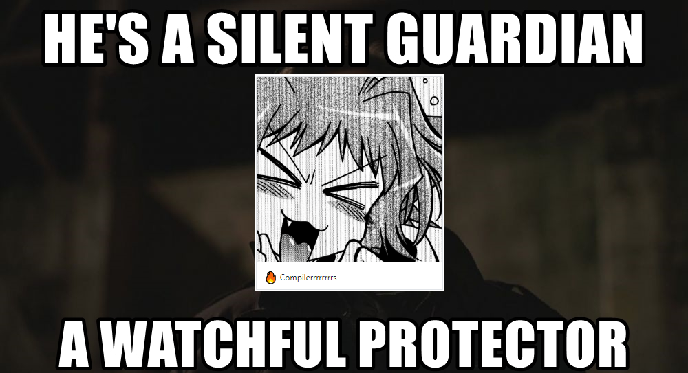

+++
date = "2019-06-16T23:00:00+05:30"
title = "Mini-Series - Dev Interview #1"
author = "CaptV0rt3x"
forum = 117857
+++

Hey there, people!
This is a new mini-series of dev interviews, with which we sneak a peek into the lives of our developers.
<!--more-->


This mini-series has already been underway for our Patreon supporters and we realized that you all deserve this too. So, here it is. Enjoy.


We already know and I guess most of you would agree, when we say our devs are awesome!
They are modern day wizards and the work they do is nothing short of magic.
But as they don't interact much with normal users, you guys might not know much about them.
This needs to change and we are here to fix that!

So to start off this new mini-series, let's interview - ***The Silent Guardian, The Watchful Protector, and The Amazing - Lioncache!!***

[Lioncache](https://github.com/lioncash/) has been in the emulation scene for ages.
You may also know him from the Nintendo GameCube/Wii emulator [Dolphin](https://dolphin-emu.org/), as he is one of the core maintainers there as well!
[Lioncache](https://github.com/lioncash/) has also worked on other emulators like [Citra](https://citra-emu.org/), and even dabbling with Commodore 64 emulation!
We managed to pull him away from programming for a few minutes so that he could sit down and talk with us.
***

**Q: Hi Lioncache! Could you tell our audience a little bit about yourself?**

**L:** Heya! I'm Lioncache. I'm some rando Canadian that likes working on system emulators because I find them fun.

**Q: So what got you into emulation in the first place?**

**L:** Honestly, it just looked fun.
CPU's are really cool (when they're not being silly) and reverse engineering looked cool (turns out, it really is).
You genuinely learn quite a bit about software and hardware by working on emulation-related things.
It also helps out with one of the many facets of game preservation, which is always nice.

**Q: Speaking of game preservation, why is that so important to you?**

**L:** It's important mainly because without external preservation, there's no guarantee that certain games will always be available.
Companies aim to turn a profit from backwards compatibility when they re-release older games from previous consoles on newer hardware.

Businesses generally aim to strive for a profit (welcome to Econ-101, y'all).
So what this usually means is that only the most popular games with a sizable demand will generally have official re-releases considered for them.
I may not totally agree with that, but it's generally the way things are.
This is generally, why you'll see re-releases of Mario games, Legend of Zelda, etc, but certain other games will, "fall through the cracks of time".
 
For example, consider `Marvelous: Mōhitotsu no Takarajima` for the SNES.
This is a fantastic RPG released in 1996, which was directed by `Eiji Aonuma` (who went on to become the series producer for `The Legend of Zelda`).
The game itself reused the engine that was made for `The Legend of Zelda: A Link to the Past`. 



So, much of the movement and characteristics are similar but it also had its own unique party system and other things that made it it's own distinct game, and it was really fun to play.
To my knowledge, it hasn't had a re-release in any capacity, nor was it ever localized.
However in 2016 an English fan translation of the game was released, making the game accessible to the English-speaking community.

Another popular game, which is kind of infamous for not actually being localized and released in North America or Europe during the era of the GameBoy Advance was `Mother 3`.
Plans were initially made to localize it, but it never occurred--plans fell through.
This too, also had an English fan translation made for it.
Which would have been difficult, had the game not been preserved in some form.



When you have preserved games (in any capacity), along with emulators, it allows potentially doing more with that game. 
Consider the scenario where all known cartridges of the game have bit rotten to the degree that they're no longer playable: the game would be considered lost (as far as the public is concerned).

No one would be able to experience that game, no one would have been able to start a fan translation and made such a great game accessible to those that know English, but not Japanese.
Preservation makes sure that the effort people put into making a game is not lost, while allowing being transformative with the game itself.
It prevents an experience from completely vanishing.

Game preservation also acts as a secondary backup in the event the actual owning body of the game screws up.
Companies, development teams, anything with a human (or other animal :P) is prone to making mistakes.
Without other people preserving those games, you essentially have a single-point of failure.
No preserved dumps of the game, no emulators, and someone accidentally deletes the source code for said game? Gone. 
Forever (unless it's completely remade).
This is why I find game preservation and archiving important.

**Q: This is some really great insight and we appreciate you sharing with us! Well let's get into the meat and potatoes. Can you tell us what you've been working on for yuzu?**

**L:** I mostly bounce all over the place because I prefer staging all my changes as their own PR, so I usually end up waiting on stuff to be merged, so I have a few areas I work on stuff:

#### Display
You've probably seen me breaking out stuff into classes and reorganizing things there.
That's all the busywork before I can actually start implementing things.

These are the main display services and what they do:
 
 * `vi:u`: the application level display services—this is what general applications (as the name suggests) will access for basic display stuff.
 * `vi:m`: the manager level services—this is what something running in the background, like a compositor, would use. It can fiddle around with display layers and stuff. This service has the most access to everything out of all vi: services. It has no restrictions.
 * `vi:s`: the system level services—this is used by, well, the system. This service is like vi:u, except it can also retrieve info about various things related to the display.

Handling this stuff properly would be nice, since we can properly see how games are trying to interact with displays in a nicer manner.

#### Audio
Inputs go in, bangin' tunes come out.
We need more of the "bangin' tunes" portion.
So basically I just try to implement things that make audio-related functionality work much nicer.

#### CPU
Our recompiler, dynarmic, isn't complete.
The 64-bit side of things almost is, but it's not totally complete.
We're missing some instructions, but they're instructions where it doesn't really make sense to use them from a performance standpoint if you're a game dev.
So most of the time users of yuzu don't need to care about it.
However, until we implement all of them, we can't kick our interpreter library (unicorn) into the sun.
So over time I'll be working on that.
We also still need to support 32-bit games, that'll come after the 64-bit side of things is all done.

#### Kernel
We don't implement everything the kernel is able to do, so this is quite a large area all on its own.
It's also one of the most fundamental parts of Switch emulation, given it drives almost everything else in the emulator in terms of backing functionality (emulated processes, threads, memory mappings, etc).
There's no real specific part of the kernel that I focus on.

It's more of a cascading effect when working on it:
`Oh, so I make [x] work right, then, with that in place, I can follow up with making [y] work properly.`, etc.

**Q: Phew, is that all you do? Just kidding! Do you ever find time to eat during all of this?**

**L:** Hit me with that phat spicy Japanese food any day or any spicy food in general.
***

Big thanks to [Lioncache](https://github.com/lioncash/), for sitting with us for this interview and also to special thanks to Jon S. for being the interviewer.
We hope you guys enjoyed it, and we will be back soon with another featured Yuzu dev to bring you guys behind the curtain again.
Until then, thank you for your support and stay tuned!

&nbsp;
<h4 style="text-align:center;">
<b>Please consider supporting us on [Patreon](https://www.patreon.com/yuzuteam)! 
If you would like to contribute to this project, checkout our [GitHub](https://github.com/yuzu-emu/yuzu)!</b>
</h4>