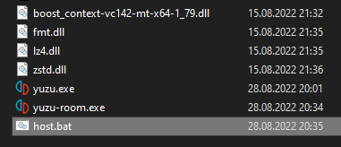

+++
title = "Multiplayer"
description = "yuzu's multiplayer feature has the ability to emulate local wireless multiplayer over the Internet."
+++

## Multiplayer Features
*yuzu*'s multiplayer feature has the ability to emulate *local wireless* multiplayer over the Internet. While on a real Switch you’d be limited to the people in your immediate vicinity, *yuzu* boasts a complex server/client infrastructure that forwards a game’s wireless communication across the internet.

Unlike single console netplay used in most emulators, users won’t have to worry about desyncs, synchronizing saves, or any other issues typical of netplay. Each user is using their instance of *yuzu* as a unique emulated Switch that is communicating with everyone else through a *multiplayer room*, a server that can be hosted by anyone for connected clients to exchange data with each other.

You can learn more about *yuzu*'s multiplayer features in [this article](https://yuzu-emu.org/entry/ldn-is-here/).

## Hosting Rooms
If you just want to play with your friends, **you do not need to create your own room**. You can just pick a room from our Public Room Browser, where plenty of public rooms hosted by us and the community are already available for use.

If you just want to temporarily host a room for you and your friends to play, the easiest way is to host a room from the UI (`Multiplayer > Host Room`). The room will be deleted once the host exits yuzu. You will still need to configure `Port forwarding` if you and your friends are not on the same network.

However, if you really want to host your own dedicated room, there are a few points you should keep in mind:

* As a room is actually a server, the computer hosting it has to be running 24x7. Therefore, it is usually not feasible to use your home or work PC to host a room.
* To ensure the best experience while playing, rooms should have a good Internet connection as well as a high bandwidth. *This is especially important if you are hosting a public room - no one would want random disconnections while playing!*
* yuzu rooms can be quite costly in terms of data transfer. Please be aware that hosting a popular public room can cause a lot of traffic for your server.

Therefore, the best option to host a room is usually to use a VPS provider, such as [Linode](https://linode.com) or [DigitalOcean](https://www.digitalocean.com), to name a few.

### Port Forwarding
Typically, routers have a unified public IP for all its network members, and by default external users cannot access any of the ports (as the router won't know which member to send it to!). Therefore, if you use a router for your Internet connection, you will need to configure `Port forwarding` for your router. Detailed configuration process varies by router brand and model. Obviously we cannot provide instructions for every model, and you can refer to your router's manual or website.

<b>Forward port 24872 via UDP, or both TCP and UDP. Don't forward only TCP.</b>

For VPSes, a similar restriction (often called `Security Groups`) exists to help keep your server safe from attacks using certain ports. You may need to manually enable the ports you want to use in your VPS's dashboard.

## Hosting on Linux (Recommended)
If you are using a Linux VPS (which is the recommended option), the officially supported way of hosting dedicated rooms is using our *Docker* image.

First of all, you should install *Docker* on your system. Refer to its [documents](https://docs.docker.com/#run-docker-anywhere) regarding installation.

Once you get a *Docker* installation ready, hosting dedicated rooms is as easy as **filling in the arguments** (they will be explained later) and running the following command in terminal:
```bash
sudo docker run -d \
  --publish 5000:5000/udp \
  yuzuemu/yuzu-multiplayer-dedicated \
  --room-name "<INSERT ROOM NAME HERE>" \
  --room-description "<INSERT ROOM NAME HERE>" \
  --preferred-game "<INSERT GAME TITLE HERE>" \
  --preferred-game-id "<INSERT TITLE ID HERE>" \
  --port 5000 \
  --max_members 4 \
  --token "<INSERT YUZU ACCOUNT TOKEN HERE>" \
  --enable-yuzu-mods \
  --web-api-url https://api.yuzu-emu.org
```
Make sure the ports specified in `--publish` matches the port specified in `--port`, so that *Docker* can correctly forward your server's ports to the container.

You can also save this command (with arguments filled in) as a script for easier usage.

## Hosting on Windows
If you are on Windows, it is also possible to host rooms using a standalone executable. As you may already know, every *yuzu* release comes with three executables - `yuzu-cmd` (The command line emulator frontend), `yuzu` (The GUI emulator frontend) and `yuzu-room`, the dedicated room server which we'll use.

Steps:

1. If you do not have a *yuzu* installation yet, install it with the installer from our [official website](https://yuzu-emu.org).
1. Navigate to the folder you installed *yuzu* to, and go into `yuzu-windows-msvc` or `yuzu-windows-msvc-early-access`.
    * If you cannot recall the installation folder, right clicking on a shortcut and clicking `Open File Location` will directly bring you into the `yuzu-windows-msvc` or `yuzu-windows-msvc-early-access` folder.
    * Make sure the folder you are in contains the `yuzu-room` executable.
1. Create a new text file and copy the following script inside, **fill in the arguments** (they will be explained later) and then use `File > Save As...` to save it to `host.bat`. You can delete the original text file after that.
1. You can now double click on the batch script named `host` to start hosting.

```
yuzu-room ^
  --room-name "<INSERT ROOM NAME HERE>" ^
  --room-description "<INSERT ROOM DESCRIPTION HERE>" ^
  --preferred-game "<INSERT GAME TITLE HERE>" ^
  --preferred-game-id "<INSERT TITLE ID HERE>" ^
  --port 5000 ^
  --max_members 4 ^
  --token "<INSERT YUZU ACCOUNT TOKEN HERE>" ^
  --enable-yuzu-mods ^
  --web-api-url https://api.yuzu-emu.org ^
  --ban-list-file "<INSERT BAN LIST FILE PATH HERE>"
pause
```



## Command Line Arguments
Both the *Docker* image and the `yuzu-room` executable takes a number of command line arguments.
Command line arguments should be specified in the format of `--<name> <value>`, for example `--port 5000`.

By default, rooms will be hosted Public. If you'd like to host a private one instead, just omit one of the fields required only for public rooms.

|Name|Required|Description
|----|--------|-----------
|`--room-name`|Yes|Name of your room.
|`--room-description`|No|An optional long description of your room.
|`--preferred-game`|Yes|The name of the preferred game of your room.
|`--preferred-game-id`|No|The Title ID of the preferred game of your room, in hex. You can find the `Title ID` with the game list of yuzu.
|`--port`|Yes|Port number to host your room on (0-65535). You should use a port that is not already used by other applications (typically a high enough port will work). Though unrecommended due to bandwidth reasons, it is possible to host multiple rooms on a single server provided the ports are distinct. **Remember to configure `Port Forwarding` for the ports!**
|`--max-members`|Yes|Maximum number of members for your room (2-16). *Note that rooms that are too large may result in slowdowns or even disconnections in certain games.*
|`--password`|No|An optional password to limit access to your room.
|`--token`|Public Rooms|Your *yuzu* Community user token. Do not know your token yet? Get it [here](https://yuzu-emu.org/wiki/yuzu-web-service/).
|`--web-api-url`|Public Rooms|URL to the *yuzu* Web API. You should not change this.
|`--ban-list-file`|No|This is a file which yuzu will store ban records in. Banning would still work even if you do not specify this, but the bans will be lost once you shut down the room.
|`--log-file`|No|File path to store the logs.

Additionally, a flag `--enable-yuzu-mods` is available. By enabling this flag, you will grant *yuzu* Community Moderators the power to moderate on your room. Do not worry, this is entirely optional and your room will still be listed even if you do not enable this.

## Authentication and Moderation
*yuzu* multiplayer rooms can authenticate users and grant certain users moderation privileges. Authenticated users get their *yuzu* Community username and avatar shown in the member list, and others can right click on them to view their *yuzu* Community profile.

Note that this feature requires interacting with the *yuzu* Web API, and therefore is only enabled for *public rooms in the Public Room Browser*. Directly connecting to the rooms (with `Direct Connect`) will leave you unauthenticated.

Currently, *yuzu* rooms grant the following members moderation privileges by default:

* Room host (i.e. members authenticated with the same user name used when hosting the room)
* *yuzu* Community Moderators, when rooms are hosted with the `--enable-yuzu-mods` flag.

Due to complexity, it is not possible to grant other users moderation privileges.

Users with moderation privileges will notice a `Moderation...` button on the right top of the Room dialog. With this you can view the current ban list and unban when needed. You can also right click on a member in the member list and click on `Kick` or `Ban` to impose moderation actions on them. Note that `Block Player` is different from a ban and is available to all users to block messages from certain members only locally.
