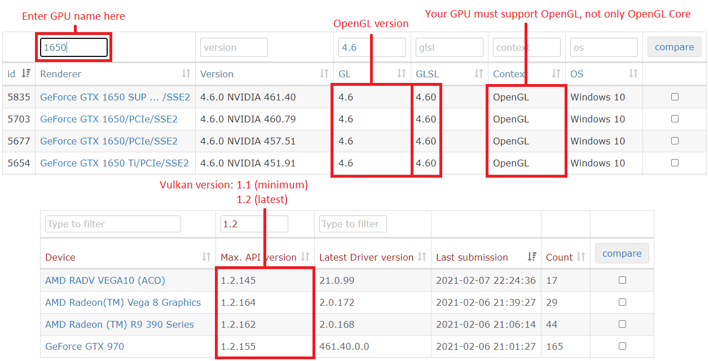


<h1 id="hardware"> </h1>
## Hardware Requirements
|   	|  CPU 	|   GPU	|   RAM	|
|-----	|---	|---	|---	|
|**Minimum (for 2D games)**|Intel Core i3-6100 / AMD Ryzen 5 2500X|Intel HD Graphics 530 / Nvidia GeForce GT 710|8GB|
|**Recommended (for 3D games)**|Intel Core i7-8700k|Nvidia GTX 1070 Ti|16GB|

<b><i>Currently on Windows, an Intel or Nvidia GPU is recommended due to AMD GPU driver issues.</b></i>

- **GPUs must support OpenGL 4.5 (or higher) & OpenGL Compatibility profile.** 
To find out if your GPU meets these requirements, visit https://opengl.gpuinfo.org and check your GPU details. 

Sample Image:

# yuzu Quickstart Guide

To start playing games, yuzu needs a couple of different files and directories from your switch in order to play them properly. 
To see if your Switch is hackable, visit https://damota.me/ssnc/checker and test your Switch's serial number. 
If your Switch is patched, you will be unable to complete the following steps.

This guide will help you copy all your system files, games, updates, and DLC from your switch to your computer and organize them in a format yuzu understands.
Make sure to place your Nintendo Switch into Airplane mode before starting this guide.
This process should take about 60 to 90 minutes.

## Prerequisites
- A Nintendo Switch vulnerable to fusee-gelee, RCM (purchased before July 2018 will definitely work, purchased after has a lower probability of working)
- An SD card with at least ~29 GB of free space (an almost empty 32GB card will work)
- [TegraRCMGui](https://github.com/eliboa/TegraRcmGUI/releases)
- [Hekate](https://github.com/CTCaer/hekate/releases/)
- [Kosmos](https://github.com/AtlasNX/Kosmos/releases/) 
- [Lockpick](https://github.com/shchmue/Lockpick/releases)
- [Lockpick_RCM](https://github.com/shchmue/Lockpick_RCM/releases)
- [nxdumptool](http://switchbru.com/appstore/#/app/gcdumptool)
- [Copy Script](https://yuzu-emu.org/help/quickstart/yuzu_copy.bat)
- [HacDiskMount](https://files.sshnuke.net/HacDiskMount1055.zip)
- [microSD Card Reader](https://www.amazon.com/Anker-Portable-Reader-RS-MMC-Micro/dp/B006T9B6R2/ref=sr_1_4?s=pc&ie=UTF8&qid=1538875513&sr=1-4&keywords=micro+sd+card+reader) -- If your computer has one built-in, you can use that
- [RCM Jig](https://www.amazon.com/gp/product/B07FP3PC4R/ref=oh_aui_detailpage_o03_s00?ie=UTF8&psc=1) <-- we highly recommend this one, but you could use any of the methods outlined [here](https://xghostboyx.github.io/RCM-Guide/)

`%YUZU_DIR%` is the home directory for yuzu on your computer:

    - For Windows, this is `C:\Users\$username$\AppData\Roaming\yuzu`
    - For Linux, this is `~/.local/share/yuzu`
    

## Dumping BIS Keys

1. We will now dump your BIS (Built-In Storage) keys for use in later decryption.
    - 1a. Run the TegraRCMGui installer you downloaded from the prerequisites, and after installation, start the program. 
    - 1b. In the `Settings` tab, click on `Install Driver` which will install the drivers necessary for your computer to interface with your Nintendo Switch. 
    - 1c. After the drivers have been installed, plug your Nintendo Switch into your computer.
    - 1d. Power off your Switch while it is still connected to your computer.
    - 1e. Insert your RCM jig into the right joy-con slot, make sure it is seated securely at the base, and then press VOL+ and Power at the same time. Nothing should happen on your Switch; if the switch starts to turn on normally, go back to the beginning of step 1d and try again.
    - 1f. In the program TegraRCMGui you should see the Nintendo Switch icon in the lower left corner flash green and state `RCM O.K.`
    - 1g. In the `Tools` tab of TegraRCMGui, click on `biskeydump (by rajkosto)`.
    - 1h. Your Switch will briefly flash with a blue QR code, and immediately your computer will prompt you to save a text document titled `BIS_keys.txt` Navigate to `%YUZU_DIR%/keys` and save the file as `console.keys`. Open the file to make sure you have copied:
        - `HWI`
        - `SBK`
        - `TSEC KEY`
        - `BIS KEY 0 (crypt)`
        - `BIS KEY 0 (tweak)`
        - `BIS KEY 1 (crypt)`
        - `BIS KEY 1 (tweak)`
        - `BIS KEY 2 (crypt)`
        - `BIS KEY 2 (tweak)`
        - `BIS KEY 3 (crypt)`
        - `BIS KEY 3 (tweak)`

<h1 id="keys"> </h1>
# Dumping Prod.keys, and Title.keys

2. We will now dump your `prod.keys` and `title.keys` for decryption of your game files.
    - 2a. Extract the Kosmos package you downloaded earlier from the prerequisites onto the root of your SD card. Place the `Lockpick.nro` you downloaded earlier from the prerequisites into the `switch` folder of your SD card, and place the `Lockpick_RCM.bin` into the `bootloader/payloads` folder of the SD card.
    - 2b. Boot your Nintendo Switch into RCM mode, and make sure it is connected to your computer.
    - 2c. Run TegraRCMGui, and in the `Payload` tab of TegraRCMGui, click on the folder icon and navigate to the `Hekate` file you downloaded earlier from the prerequisites.
    - 2d. Click on `Inject Payload` to inject the Hekate payload. The Hekate browser will now display on your Nintendo Switch.
    - 2e. At the top of the Hekate menu, click on `Console Info`
    - 2f. On the left side of the screen click on `TSEC Keys`, and then click `Dump Keys` at the top of the screen. Click OK on the following message, then click Close.
    - 2g. On the same screen as before, click `Fuses`, and then click on `Dump fuses` at the top of the screen. Click OK on the following message, then click Close.
    - 2f. Click on the Home button at the top of the screen, and then on the home screen click on `Payloads`.
    - 2g. On the list of payloads to launch, you should see listed `Lockpick_RCM.bin` Click on this. 
    - 2h. There may be a message on your Switch to `Reboot to Sept...`, or there may be just a blank black screen; Press `Power` or `Vol +/-` to boot into the `Lockpick_RCM.bin` payload. 
    - 2i. After Lockpick_RCM has finished deriving the keys, please make note of the location of the key file. Default is: `sd:/switch/prod.keys`.
    - 2j. Reboot to RCM by pressing the `VOL +` key. 
    - 2k. Run TegraRCMGui, and in the `Payload` tab of TegraRCMGui, click on the folder icon and navigate to the `Hekate` file you downloaded earlier from the prerequisites. 
    - 2l. Click on `Inject Payload` to inject the Hekate payload. The Hekate browser will now display on your Nintendo Switch.
    - 2m. On the home screen of the Hekate menu, click on `Launch`, and then click on `CFW (SYSNAND)`. Your Switch will launch into Custom Firmware Mode (CFW), and once your Switch has booted into the home menu, while holding the `R` button, click on the Album application. This will launch the Homebrew Menu.
    - 2n. Either use the touchscreen or navigate using your controller and choose `Lockpick`. After a few seconds, this will dump your `title.keys` file into the indicated folder. Default is: `sd:/switch/title.keys`
    - 2o. With both `prod.keys` and `title.keys` dumped from your Nintendo Switch, place them in the `%YUZU_DIR%/keys` directory. 

# Backing up System Files
3. We will now boot Hekate to dump your system files:
    - 3a. Extract the Kosmos package you downloaded earlier from the prerequisites onto the root of your SD card.
    - 3b. Run TegraRCMGui, and in the `Payload` tab of TegraRCMGui, click on the folder icon and navigate to the Hekate file you downloaded earlier from the prerequisites.
    - 3c. Click on `Inject Payload` to inject the Hekate payload. The Hekate browser will now display on your Nintendo Switch.
    - 3d. Select `Tools`, the wrench icon at the top of the screen, and select `Backup eMMC`. Underneath the `Full` section, click on `eMMC BOOT0 & BOOT1`. This may take a few seconds to load. After it is finished filling the progress bar it should say `Finished and verified!`. Beneath `Filepath:` you will see the location of the dump. 
    - 3e. Click `Close` and select `eMMC RAW GPP`. This should take some time as your Switch's rawnand.bin is quite large. If the progress bar appears to go backwards at some points or turn green, do not worry as this is Hekate verifying the data. This should take between 30-60 minutes depending on the quality of your SD card and the default verification setting. Please keep note of the location the output file is placed.
    - 3f. Power off your switch to avoid damage to your sd card, by selecting `Back` and then selecting `Power Off` and then eject your sd card. Insert your sd card into your computer and use your file explorer to open the contents. Place the `yuzu_copy.bat` file you downloaded earlier onto to the root of your sd card. Double-click it to start combining your `rawnand.bin`, if it was dumped into sections, i.e. `rawnand.bin.00`. If your rawnand.bin dumped as one ~30gb file, then proceed with the guide. 
    - 3g. If you needed to dump the rawnand.bin into sections due to lack of space on your sd card, transfer the files that did dump to a new folder on your desktop, and then resume the backup of your `eMMC RAW GPP`. After you have obtained all of the `rawnand.bin` files, add them to the same folder as before, place the `yuzu_copy.bat` file you downloaded earlier into that same folder and double-click to run. After they are combined, please proceed with the guide.

# Move SYSTEM and USER to the yuzu directory
4. We will now extract the necessary directories from your rawnand.bin for yuzu to read your system files. 
    - 4a. Open `HacDiskMount` as Administrator (Right-click and select Run As Administrator) and go to `File > Open file` and select your `rawnand.bin`.
    - 4b. Double-click on the row marked `PRODINFO`. Under the dump to file area, click browse and pick somewhere easy to get to, like your Desktop. Dump the file as `PRODINFO.bin`. Click start and wait for it to complete. Then close the window. (NOTE: There is no need to enter any keys in the boxes at the top of the dialog at this moment.)
    - 4c. Select the row named `BCPKG2-1-Normal-Main`. Under the dump to file area, click browse and pick somewhere easy to get to, like your Desktop. Dump the file as `BCPKG2-1-Normal-Main.bin`. Click start and wait for it to complete. Again, no keys are necessary at this point. After it finishes, close the window.
    - 4d. Copy the `PRODINFO.bin` and `BCPKG2-1-Normal-Main.bin` files to the `%YUZU_DIR%/sysdata` dir.
    - 4e. Double-click on the row named `SYSTEM`. In the keys box, enter the `bis_key2_crypt` key in the crypt box and the `bis_key2_tweak` key in the tweak box (both acquired from the QR Code) and click test. If the text is red, double check your keys. If the text is blue, click on `Install` and wait until it says `Driver (ver XXXXX) installed, Service is running` where XXXXX is anything, then select `Y:` in the dropdown and click `Mount`. The application may become unresponsive for a moment. Press Windows-R and type `Y:` into the box and click OK and there will be a couple of folders with some named `Contents` and `save`. Copy all of these into `%YUZU_DIR%/nand/system`. After this is done, click `Unmount` and close the window.
    - 4f. Double-click on the row named `USER`. Enter the same key. Click `Mount`, and the tool may become unresponsive again. Once this mounts, open the new drive and copy the `Contents` and `save` folders to `%YUZU_DIR%/nand/user`. After, click `Unmount` and close the window and then the program.
    - 4g. If you have games or game data stored on your sd card, copy the `Nintendo` folder of your sd card into `%YUZU_DIR%/sdmc`.

<h1 id="cart"> </h1>
# Dumping cartridge games

5. We will now dump the `Cartridge Image (XCI)` files from your game cartridge, to use in yuzu. Insert the game cartridge of your choice.
    - 5a. Extract the Kosmos package you downloaded earlier from the prerequisites onto the root of your SD card.
    - 5b. Extract the contents of the nxdumptool package you downloaded earlier and place the contents of the Switch folder into the Switch folder of your sd card.
    - 5c. Run TegraRCMGui, and in the `Payload` tab of TegraRCMGui, click on the folder icon and navigate to the Hekate file you downloaded earlier from the prerequisites.
    - 5d. Click on `Inject Payload` to inject the Hekate payload. The Hekate browser will now display on your Nintendo Switch.
    - 5e. In the Hekate browser on your Nintendo Switch, click on `Launch`, and then click on `CFW (SYSNAND)`. Your Switch will launch into Custom Firmware Mode (CFW), and once your Switch has booted into the home menu, while holding the `R` button, click on the Album application. This will launch the Homebrew Menu.
    - 5f. Either use the touchscreen or navigate using your controller, and choose `nxdumptool`
    - 5g. Chose the `Dump gamecard content` option. 
    - 5h. Chose the `Cartridge Image (XCI) dump` option. 
    - 5i. Make sure to dump the certificate with the cartridge. The options can be toggled by pressing `left` or `right`. 
    - 5j. Once the cartridge image has been dumped, place it into a new folder in a location of your choice.

# Running yuzu

5. We will now run yuzu to verify that your keys and system files were dumped and are being read correctly by yuzu.
    - 6a. Locate the `yuzu.exe` file in the location indicated by the installer and run the program. You should see the screen populate with your games located both on your SD card and system memory.
    - 6b. If you extracted your `XCI` files from your Nintendo Switch cartridges, then, in yuzu, click on `+ Add New Game Directory` in the browser, and navigate to the folder where you placed your `XCI` files.

### If you need any help during this process or get a strange error during or while using yuzu, feel free to ask for help on the yuzu discord! Happy Emulating!

