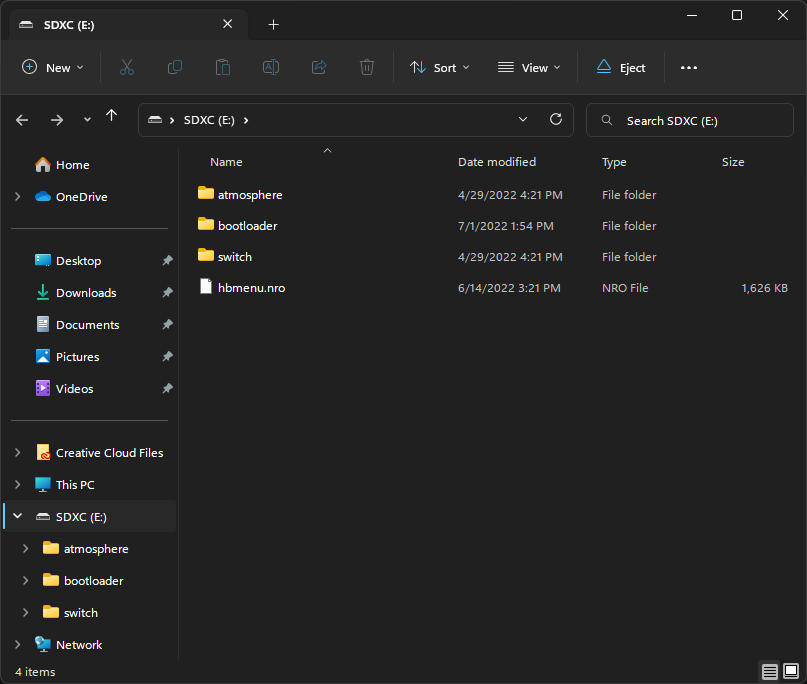
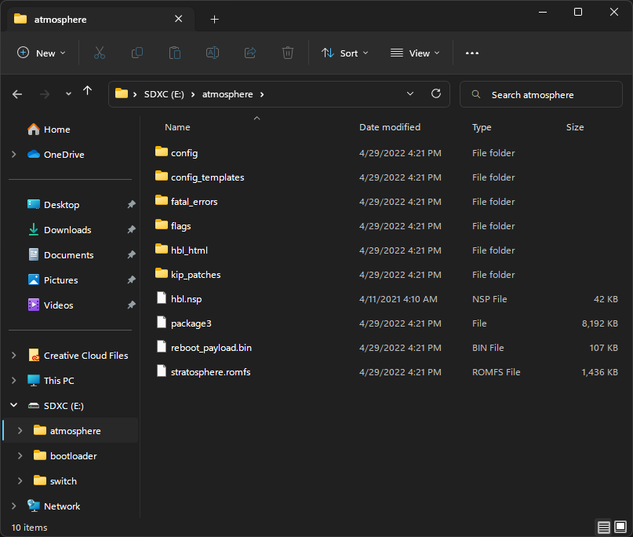
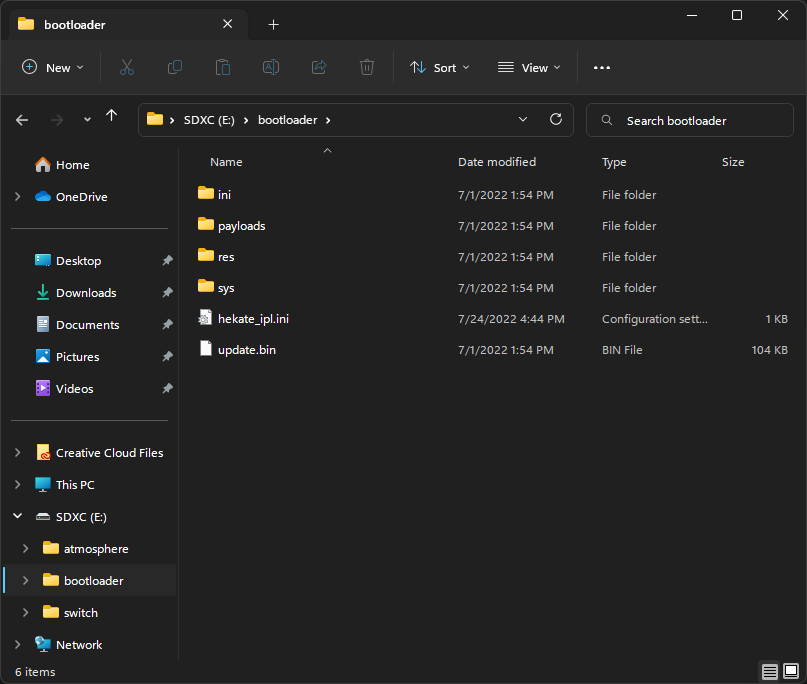
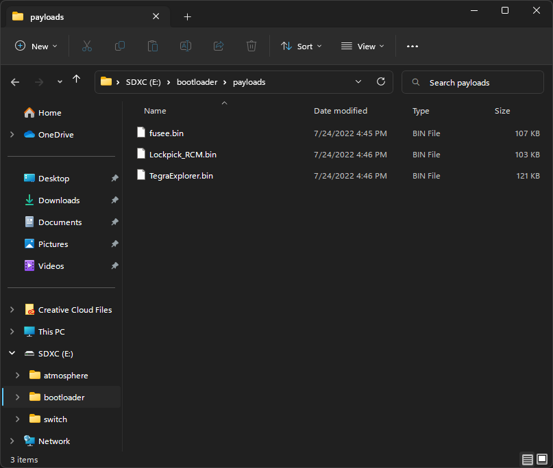
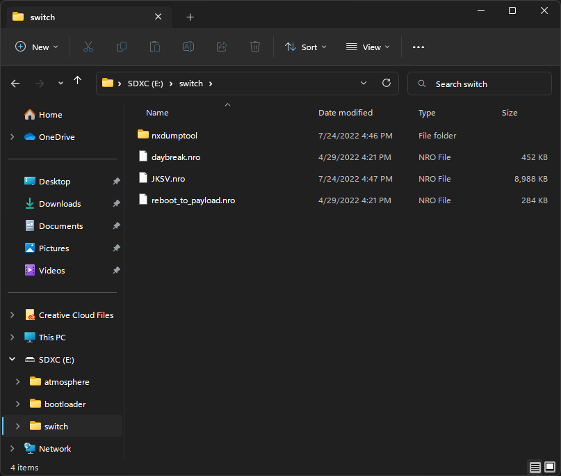

## Table of Contents

* [Downloading and Installing yuzu](#downloading-and-installing-yuzu)
* [Hardware Requirements](#hardware-requirements)
* [Guide Introduction](#guide-introduction)
* [Prerequisites](#prerequisites)
* [Booting into RCM](#booting-into-rcm)
* [Preparing the microSD Card](#preparing-the-microsd-card)
* [Booting Hekate from RCM](#booting-hekate-from-rcm)
* [Formatting the microSD Card to FAT32 (Recommended)](#formatting-the-microsd-card-to-fat32-recommended)
* [Backing up Switch NAND (Optional)](#backing-up-switch-nand-optional)
* [Dumping Decryption Keys](#dumping-decryption-keys)
* [Dumping System Firmware](#dumping-system-firmware)
* [Dumping Games](#dumping-games)
    * [Dumping Physical Titles (Game Cards)](#dumping-physical-titles-game-cards)
        * [Dumping Installed Updates/DLCs from Physical Titles](#dumping-installed-updatesdlcs-from-physical-titles)
    * [Dumping Digital Titles (eShop)](#dumping-digital-titles-eshop)
        * [Dumping Installed Updates](#dumping-installed-updates)
        * [Dumping Installed DLCs](#dumping-installed-dlcs)
* [Dumping Save Files (Optional)](#dumping-save-files-optional)
* [Booting Hekate from CFW](#booting-hekate-from-cfw)
* [Mounting the microSD Card from your Switch to your Computer](#mounting-the-microsd-card-from-your-switch-to-your-computer)
* [Setting up yuzu](#setting-up-yuzu)
    * [Setting up the Decryption Keys and Firmware](#setting-up-the-decryption-keys-and-firmware)
    * [Transferring Games](#transferring-games)
    * [Merging Split Game Dumps](#merging-split-game-dumps)
    * [Adding Games to yuzu](#adding-games-to-yuzu)
    * [Installing Game Updates/DLCs to yuzu](#installing-game-updatesdlcs-to-yuzu)
    * [Transferring Save Data of a Game to yuzu](#transferring-save-data-of-a-game-to-yuzu)
* [Rebooting Back to Stock Firmware](#rebooting-back-to-stock-firmware)
* [Running yuzu](#running-yuzu)

## Downloading and Installing yuzu



## Hardware Requirements

#### CPU:

Any x86_64 CPU with support for the FMA instruction set, or an ARM64-v8a or newer CPU. 6 threads or more are recommended.

- **Minimum:** Intel Core i5-4430 / AMD Ryzen 3 1200 / Qualcomm Snapdragon 460

- **Recommended:** Intel Core i5-11400 / AMD Ryzen 5 3600 / Qualcomm Snapdragon 865

- **Optimal:** Intel Core i9-13900K / AMD Ryzen 7 7800X3D / Qualcomm Snapdragon 8 Gen 2

#### Dedicated graphics:

OpenGL 4.6 or Vulkan 1.1 compatible hardware and drivers are mandatory. Half-float support and VP9 decoding support are recommended.

- **Minimum for Linux:** NVIDIA GeForce GT 1050 4GB / AMD Radeon R7 240 4GB

- **Minimum for Windows:** NVIDIA GeForce GT 1050 4GB / AMD Radeon RX 550 4GB

- **Recommended:** NVIDIA GeForce GTX 1660 6GB / AMD Radeon RX 5500 8GB [(with "Force maximum clocks" enabled)](https://yuzu-emu.org/entry/yuzu-progress-report-jan-2023/turboui.png)

- **Optimal:** NVIDIA Geforce RTX 3060 12GB / AMD Radeon RX 6700 10GB [(with "Force maximum clocks" enabled)](https://yuzu-emu.org/entry/yuzu-progress-report-jan-2023/turboui.png)

#### Integrated graphics:

Integrated graphics will produce very low performance. A dedicated GPU will produce better results on all scenarios.
This is only for listing iGPU support.

- **Minimum for Linux:** Intel HD Graphics 4400 / AMD Radeon R5 Graphics

- **Minimum for Windows:** Intel UHD Graphics 730 / AMD Radeon Vega 3

- **Minimum for Android:** Qualcomm Adreno 605 (with Turnip drivers) / ARM Mali G57

- **Recommended:** Intel Iris Xe Graphics / AMD Radeon 680M / Qualcomm Adreno 740 / ARM Mali G720

#### RAM:

Since an integrated GPU uses system RAM as its video memory (VRAM), our memory requirement in this configuration is higher. Highest possible frequency is strongly recommended.

- **Minimum with dedicated graphics & for Android:** 8 GB

- **Minimum with integrated graphics:** 12 GB

- **Recommended:** 16 GB

- **Optimal:** 32 GB

#### Notes:

- An up-to-date Windows 10 version is required, old Windows 10 releases or older Windows versions are not supported. Windows 11 offers similar performance.

- Our recommended/optimal specifications don't guarantee perfect performance in all games, but rather strive to provide a cost effective recommendation while still considering performance.

- CPUs lacking the FMA instruction set will produce very poor results. Intel Core gen 3 series or older and old Pentium/Celeron/Atom CPUs will not produce optimal results.

- Mobile CPUs will not reach the same performance as their desktop counterparts due to thermal, power, and technical limitations.

- Check our recommended settings and drivers [here](https://community.citra-emu.org/t/recommended-settings/319349).

- **GPUs must support OpenGL 4.6 & OpenGL Compatibility profile, or Vulkan 1.1 (or higher).**<br>
To find out if your GPU meets these requirements, visit https://opengl.gpuinfo.org or https://vulkan.gpuinfo.org/ and check your GPU details.<br>

Sample Image:


## Guide Introduction

To start playing commercial games, yuzu needs a couple of system files from a **HACKABLE** Nintendo Switch console in order to play them properly.

This guide will help you copy all your system files, games, updates, and DLC from your Switch to your computer and organize them in a format yuzu understands. This process should take about 60 to 90 minutes.

<article class="message has-text-weight-semibold">
    <div class="message-body">
        <p>DISCLAIMER:</p>
        <ul>
            <li>This guide is designed for early Switch consoles that are vulnerable to the <code>fusée-gelée</code> RCM exploit, as it is the most accessible entryway to load custom firmware and run the tools necessary to obtain the required system files and games.
            <li>While there are possible ways to jailbreaking patched Switch models, instructions for booting into custom firmware may differ from this guide, but the overall dumping process should mostly be the same as long as you are able to run Hekate and Atmosphére on your console.
            <ul>
                <li>Join the <a href="https://discord.gg/u77vRWY">yuzu Discord server</a> for any further assistance on this case.</li>
            </ul>
            <li>The following Switch models are patched from <code>fusée-gelée</code> and therefore, unable to complete the first couple of steps:
            <ul>
                <li>Original Switch model manufactured after 2018.
                <ul>
                    <li>Visit <a href="https://ismyswitchpatched.com/">Is My Switch Patched?</a> to check if your console is patched.</li>
                </ul>
                <li>Mariko Switch released in late 2019 (also known as the Red Box Switch, HAC-001(-01))</li>
                <li>Nintendo Switch Lite (HDH-001)</li>
                <li>Nintendo Switch OLED Model (HEG-001)</li>
            </ul>
        </ul>
    </div>
</article>

## Prerequisites

- A **hackable** Nintendo Switch console (preferably a model that is vulnerable to the `fusée-gelée` exploit).
    - Visit [Is My Switch Patched?](https://ismyswitchpatched.com/) to check if your console is not patched.
- A **microSD card** with at least `32 GB` of storage capacity. `64 GB` or higher is recommended.
- A **USB-C to USB-A** or **USB-C to USB-C cable** to connect your Switch to your computer.
- [TegraRcmGUI](https://github.com/eliboa/TegraRcmGUI/releases/latest) -- Download `TegraRcmGUI_v2.6_Installer.msi`
- [ums-loader](https://github.com/lulle2007200/ums-loader/releases/latest) -- Download `ums-loader.bin`
- [Hekate](https://github.com/CTCaer/hekate/releases/latest) -- Download `hekate_ctcaer_X.X.X_Nyx_X.X.X.zip`
    - **Windows users:** Also download `nyx_usb_max_rate__run_only_once_per_windows_pc.reg` and run it for faster transfer speeds over USB. For details, see the **NOTE** section in the release page.
- This hekate configuration file -- [hekate_ipl.ini](./hekate_ipl.ini)
- [Atmosphére](https://github.com/Atmosphere-NX/Atmosphere/releases/latest) -- Download both `atmosphere-X.X.X-master-XXXXXXXX+hbl-X.X.X+hbmenu-X.X.X.zip` and `fusee.bin`.
- [Lockpick_RCM](https://github.com/shchmue/Lockpick_RCM/releases/latest) -- Download `Lockpick_RCM.bin`
- [NXDumpTool](https://github.com/DarkMatterCore/nxdumptool/releases/latest) -- Download `nxdumptool.nro`
- [nxDumpFuse](https://github.com/oMaN-Rod/nxDumpFuse/releases/latest) -- Download `win-x64.zip`
- [TegraExplorer](https://github.com/suchmememanyskill/TegraExplorer/releases/latest) -- Download `TegraExplorer.bin`
- (Optional) [JKSV](https://github.com/J-D-K/JKSV/releases/latest) -- Download `JKSV.nro`
    - Download this homebrew application if you wish to dump your save data from your Switch to yuzu.
- [RCM Jig](https://www.amazon.com/dp/B07J9JJRRG) -- We highly recommend one like this, but you could use any of the methods outlined [here.](https://noirscape.github.io/RCM-Guide/)

## Booting into RCM

The Switch has a hidden recovery mode called `RCM`. The `fusée-gelée` exploit abuses a critical error from RCM, where binaries sent to the console have their data read before checking for signatures. As such, you can run any custom code on your Switch as long as it's vulnerable to this exploit. However, these steps won't work on patched models despite RCM also existing on such consoles.

**Step 1:** Open the **TegraRcmGUI installer** (`TegraRcmGUI_v2.6_Installer.msi`), go through the installation wizard, and start **TegraRcmGUI**. 

**Step 2:** In the `Settings` tab, click on `Install Driver` and follow the installation instructions.

**Step 3:** After the drivers have been installed, connect your Switch to your computer using a **USB-C cable**.

**Step 4:** Hold the `Power` button to enter the power menu, select `Power Options` and then select `Power Off`. Keep your Switch connected to your computer.

**Step 5:** Insert your **RCM jig** into the **right side Joy-Con rail**, make sure it is seated securely at the base.

**Step 6:** Hold `Volume +` and press the `Power` button.

If you see the Switch icon turn **green** with `RCM O.K.` in the TegraRcmGUI window, your console has successfully booted into RCM mode. 
> If your Switch starts to turn on normally (Nintendo logo appears), go back to **Step 4** and try again.

Once you have successfully booted into RCM mode, you can now remove the RCM jig from the console.

## Preparing the microSD Card

We'll now place some files downloaded from the prerequisites section to the microSD card. We can mount the card from a Switch to a computer via USB using the **ums-loader** payload.

**Step 1:** Insert the microSD card into the microSD card slot of your Switch.

**Step 2:** Open **TegraRcmGUI**. In the `Payload` tab, click on the folder icon and navigate to the `ums-loader.bin` file you downloaded earlier.

**Step 3:** Click on `Inject Payload` and your Switch will now boot into the UMS menu.

**Step 4:** Navigate through the menu using the `Volume` buttons and select `Start UMS` using the `Power` button. You should see a removable drive showing up on your computer.

**Step 5:** Open the file explorer and navigate to the microSD card drive.
> **NOTE:** If you have a `Nintendo` folder in your microSD card, make a backup of it by copying the folder to your computer.

**Step 6:** Extract all the contents inside the `atmosphere-X.X.X-master-XXXXXXXX+hbl-X.X.X+hbmenu-X.X.X.zip` archive into the root of the microSD card.

**Step 7:** Extract the `bootloader` folder from inside the `hekate_ctcaer_X.X.X_Nyx_X.X.X.zip` archive into the root of the microSD card.
> **IMPORTANT:** Drag and drop the contents, do not create any new folders from the previous `.zip` files.

**Step 8:** Place the `hekate_ipl.ini` file into the `bootloader` folder.

**Step 9:** Place the `fusee.bin`, `Lockpick_RCM.bin` and `TegraExplorer.bin` files into the `payloads` folder (located inside the `bootloader` folder).

**Step 10:** Create a folder named `nxdumptool` within the `switch` folder and place the `nxdumptool.nro` file inside it.

> If you've downloaded JKSV from [Prerequisites](#prerequisites), place the `JKSV.nro` file into the `switch` folder.

**Step 11:** Check that you've placed all of the files correctly using the following screenshots:
<details>
<summary>Screenshots</summary>







</details>

**Step 12:** Safely eject the microSD card drive. Do not unplug the Switch from your computer yet.
>  If unsure of how to safely eject media, use one of the following support pages corresponding to your OS:
> - **Windows users:** [Safely remove hardware in Windows](https://support.microsoft.com/en-us/windows/safely-remove-hardware-in-windows-1ee6677d-4e6c-4359-efca-fd44b9cec369)

**Step 13:** From the UMS menu, select `Reboot RCM`. Your Switch will now boot into RCM mode.

## Booting Hekate from RCM

**Hekate** is a custom bootloader which allows you to load custom firmware and the many tools used for the dumping process.

**Step 1:** Extract the `hekate_ctcaer_X.X.X.bin` file from the `hekate_ctcaer_X.X.X_Nyx_X.X.X.zip` archive to any directory on your computer.

**Step 2:** Open **TegraRcmGUI**. In the `Payload` tab, click on the folder icon and navigate to the `hekate_ctcaer_X.X.X.bin` file you extracted earlier.

**Step 3:** Click on `Inject Payload` and your Switch will now boot into the Hekate custom bootloader.

> **NOTE:** If you see a vertical text-based menu appearing on your Switch's display, some of the Hekate files might not be stored in the correct places in your microSD card. Use the `Volume` buttons to navigate through the Hekate menu and select `Power off` using the `Power` button to turn off the console. Make sure that the files in your microSD card match up with the images shown in [Preparing the microSD Card](#preparing-the-microsd-card) and then try again.

## Formatting the microSD Card to FAT32 (Recommended)

We'll now format the microSD card to `FAT32` using **Hekate**.
> **NOTE:** The `exFAT` file system is not recommended for regular usage on the Switch, as it's prone to file corruption. Large capacity microSD cards are usually formatted as `exFAT` by default.

**Step 1:** In the Hekate Home menu, tap on the `Tools` tab and select `Partition SD Card`.
> Hekate's partition manager by default will temporarily store all data from the card into memory and places it back after the formatting process is done. If the pop-up windows says that data cannot be backed up, select the `SD UMS` option to mount the microSD card to your computer to manually back up your data.

**Step 2:** Tap `OK` on the pop-up and then tap `Next Step`.

**Step 3:** Tap `Start` to start the formatting process. After the safety timer, press the `Power` button.

**Step 4:** Once the formatting process has completed, tap `OK`.
> If you have backed up your `Nintendo` folder, you can select the `SD UMS` option from the Partition Manager menu to mount the microSD card to your computer and place it back in there. Once you're done, safely eject the drive and then tap `Close` and `OK` on your Switch to proceed with the last step.

**Step 5:** Tap `Close` and lastly `Home` to return to the Hekate Home menu.

## Backing up Switch NAND (Optional)

All the tools used in this guide do not alter or modify the data stored inside the Switch. However, it is possible to make a backup of the entire internal storage (`NAND`) of your console using **Hekate** for recovery purposes.

**Step 1:** In the Hekate Home menu, tap on the `Tools` tab and select `Backup eMMC`.

**Step 2:** Tap on `eMMC BOOT0 & BOOT1`.
> This may take a few seconds to load. After the progress bar has finished, it should show `Finished and verified!`. Beneath `Filepath:` you will see the location of the `BOOT0` and `BOOT1` dump. 

**Step 3:** Tap on `Close` and select `eMMC RAW GPP`.
> This should take some time as a Switch's `rawnand.bin` file is quite large. If the progress bar appears to go backwards at some points or turn green, do not worry as this is just Hekate verifying the data. The backup process should take between 10-45 minutes to complete depending on the quality/speed of your microSD card at the default verification setting. Keep note of the location of the output file(s).

**Step 4:** Tap on `Close` twice to return to the `Tools` menu.

To access the NAND backup, we'll now mount the microSD card as a drive from your Switch to your computer via USB.

**Step 5:** Tap on `USB Tools` and select `SD Card`. The microSD card should now show up on your computer as a USB drive.

**Step 6:** Navigate to the microSD card drive and copy the `backup` folder to your computer.

**Step 7:** Once the file transfer has completed, safely eject the microSD card drive. Do not unplug the Switch from your computer yet.
>  If unsure of how to safely eject media, use one of the following support pages corresponding to your OS:
> - **Windows users:** [Safely remove hardware in Windows](https://support.microsoft.com/en-us/windows/safely-remove-hardware-in-windows-1ee6677d-4e6c-4359-efca-fd44b9cec369)

We'll now return to the Hekate Home menu to proceed with the remaining sections of the guide.

**Step 8:** Tap on `Close` twice to return to the `Tools` menu.

**Step 9:** Tap on the `Home` tab to return to the Hekate Home menu.

## Dumping Decryption Keys

We will now dump the decryption keys from your Switch using **Lockpick_RCM** so that yuzu is able to decrypt and open your game files (including amiibo dumps).

> **NOTE:** Make sure that your Switch is on the latest system update before proceeding with this section.
    
**Step 1:** In the Hekate Home menu, tap on `Payloads`.

**Step 2:** Tap on `Lockpick_RCM.bin` in the list of payloads.

**Step 3:** In Lockpick_RCM, press the `Power` button to select `Dump from SysNAND`.

> After Lockpick_RCM has finished dumping the keys, the files will be stored in `sdcard:/switch/prod.keys` and `sdcard:/switch/title.keys`.

**Step 4:** Press any button to return to the main menu.

**Step 5:** Navigate through the menu using the `Volume` buttons to highlight and select `Dump Amiibo Keys` using the `Power` button.

> The amiibo decryption keys will be stored in `sdcard:/switch/key_retail.bin`.

**Step 6:** Press any button to return to the main menu, then navigate using the `Volume` buttons to highlight and select `Reboot to hekate` using the `Power` button. You should now be booted back into Hekate.

## Dumping System Firmware

Some games such as _Mario Kart 8 Deluxe_ require the use of system files found inside the Switch's **System Firmware** to be playable. We'll now dump the firmware files from your Switch using **TegraExplorer**.

> **NOTE:** Make sure that your Switch is on the latest system update before proceeding with this section.

**Step 1:** In the Hekate Home menu, tap on `Payloads`.

**Step 2:** Tap on `TegraExplorer.bin` in the list of payloads.

**Step 3:** In TegraExplorer, navigate through the main menu using the `Volume` buttons and select the `FirmwareDump.te` script using the `Power` button.

**Step 4:** Select `Dump sysmmc`.

> After TegraExplorer has finished dumping the firmware, the files will be stored in `sdcard:/tegraexplorer/Firmware/<firmware version>` as a series of `.nca` files.

**Step 5:** Press any button to return to the main menu and select `Reboot to bootloader/update.bin`. You should now be booted back into Hekate.

## Dumping Games

This section covers the dumping process for any game on your Switch that is either a digital or physical copy, alongside any installed game updates and DLC. We'll be using **NXDumpTool** for this.

> **NOTE:** Make sure that all of your games are up-to-date before proceeding with this section.

**Step 1:** In the Hekate Home menu, tap on `Launch`.

**Step 2:** Tap on `CFW - sysMMC`.

> **NOTE:** If you get the following error message:
> ```
> Error while loading fss0:
> atmosphere/package3
> Wrong ini cfg or missing/corrupt files!
>
> Failed to launch HOS!
> ```
> Some of the Atmosphére files might not be stored in the correct places in your microSD card. Press any button to return to the Hekate menu and tap on `Power Off` to turn off your console. Make sure that the files in your microSD card match up with the images shown in [Preparing the microSD Card](#preparing-the-microsd-card) and then try again.

> Your Switch will now boot into the **Atmosphére** custom firmware (`CFW`). You should see the Atmosphére logo show up instead of the Nintendo logo at boot. It is normal that the HOME Menu remains the same and you can double check that you're loaded into CFW by navigating to **System Settings > System** and checking the `Current version` value.
>
> The current version value should resemble something like this: `XX.X.X|AMS 1.X.X|S`

**Step 3:** Once your Switch has booted into the HOME Menu, hold the `R` button on your controller while launching any game to access the **hbmenu**.
> The Homebrew menu (`hbmenu`) can be loaded from two different modes:
> - **Applet Mode:** Opening the **Album**, substituting the Album app by default when CFW is loaded into the system. You can still access the original app by opening **Album** while holding `R` on your controller.
> - **Title Override:** Holding `R` on your controller while launching any game.
>
> For the purpose of this section, we are launching the **hbmenu** via **Title Override** as that mode will grant full RAM access from the console for maximum performance and stability in the dumping process.

**Step 4:** Use the touchscreen or your controller to navigate through the hbmenu and select `nxdumptool`.

You should now be at the main menu of NXDumpTool, displaying the following options:
> - **Dump gamecard content**
> - **Dump installed SD card / eMMC content**
> - **Update options**

### Dumping Physical Titles (Game Cards)

**Step 1:** Select `Dump gamecard content`.

**Step 2:** Select `NX Card Image (XCI) dump`.

**Step 3:** Set the following settings:
> - **Split output dump (FAT32 support):** `Yes`
> - **Create directory with archive bit set:** `No`
> - **Keep certificate:** `No`
> - **Trim output dump:** `Yes`
> - **CRC32 checksum calculation + dump verification:** `No`

**Step 4:** Select `Start XCI dump process`. Wait for the dumping process to finish.

**Step 5:** Press any button to return to the previous menu and then press `B` twice to return to the main menu.

### Dumping Installed Updates/DLCs from Physical Titles

**Step 1:** Select `Dump installed SD card / eMMC content`.

**Step 2:** Press `Y` to enter into the `Dump installed content with missing base application` menu.

**Step 3:** Select the update or DLC you wish to dump from the list.

**Step 4:** Select `Nintendo Submission Package (NSP) dump`.

**Step 5:** Set the following settings:
> For update dumps:
> - **Split output dump (FAT32 support):** `Yes`
> - **Verify dump using No-Intro database:** `No`
> - **Remove console specific data:** `Yes`
> - **Generate ticket-less dump:** `No`
> - **Change NPDM RSA key/sig in Program NCA:** `No`
> - **Dump delta fragments:** `No`
>
> For DLC dumps:
> - **Split output dump (FAT32 support):** `Yes`
> - **Verify dump using No-Intro database:** `No`
> - **Remove console specific data:** `Yes`
> - **Generate ticket-less dump:** `No`

**Step 6:** Select `Start NSP dump process`. Wait for the dumping process to finish.

**Step 7:** Press any button to return to the previous menu. Press `B` twice if you want to return to the list of installed updates/DLCs, or press `B` twice again if you're done and want to return to the main menu.

### Dumping Digital Titles (eShop)

**Step 1:** Select `Dump installed SD card / eMMC content`.

**Step 2:** Select the game you wish to dump from the list.

**Step 3:** Select `Nintendo Submission Package (NSP) dump`.

> In this menu, you'll see the following options depending on what is installed on your console for the selected game:
> - **Dump base application NSP**
> - **Dump installed update NSP**
> - **Dump installed DLC NSP**
>
> The latter two options are covered in [Dumping Installed Updates](#dumping-installed-updates) and [Dumping Installed DLCs.](#dumping-installed-dlcs) But for now, let's focus on dumping the base application first.

**Step 4:** Select `Dump base application NSP`.

**Step 5:** Set the following settings:
> - **Split output dump (FAT32 support):** `Yes`
> - **Verify dump using No-Intro database:** `No`
> - **Remove console specific data:** `Yes`
> - **Generate ticket-less dump:** `No`
> - **Change NPDM RSA key/sig in Program NCA:** `No`

**Step 6:** Select `Start NSP dump process`. Wait for the dumping process to finish.

**Step 7:** Press any button to return to the previous menu. Press `B` twice if you want to return to the list of installed digital titles, or press `B` again if you're done and want to return to the main menu.

### Dumping Installed Updates

**Step 1:** Select `Dump installed update NSP`.

**Step 2:** Set the following settings:
> - **Split output dump (FAT32 support):** `Yes`
> - **Verify dump using No-Intro database:** `No`
> - **Remove console specific data:** `Yes`
> - **Generate ticket-less dump:** `No`
> - **Change NPDM RSA key/sig in Program NCA:** `No`
> - **Dump delta fragments:** `No`

**Step 3:** Select `Start NSP dump process`. Wait for the dumping process to finish.

**Step 4:** Press any button to return to the previous menu. Press `B` twice if you want to return to the list of installed digital titles, or press `B` again if you're done and want to return to the main menu.

### Dumping Installed DLCs

**Step 1:** Select `Dump installed DLC NSP`.

**Step 2:** Set the following settings:
> - **Split output dump (FAT32 support):** `Yes`
> - **Verify dump using No-Intro database:** `No`
> - **Remove console specific data:** `Yes`
> - **Generate ticket-less dump:** `No`
> - **DLC to dump:** Select the DLC ID to dump

**Step 3:** Select `Start NSP dump process`. Wait fot the dumping process to finish.

**Step 4:** Press any button to return to the previous menu. Press `B` three times if you want to return to the list of installed digital titles, or press `B` again if you're done and want to return to the main menu.

> If you have multiple DLCs installed for the game that you have selected, repeat **Step 2** and **Step 3** but this time selecting another DLC ID from the `DLC to dump` option.

Once you have finished dumping your game files, press the `+ (Plus)` button on your controller to exit NXDumpTool and return to the hbmenu.

## Dumping Save Files (Optional)

We'll now dump the save data of all your games to transfer your progress to yuzu using **JKSV**.

**Step 1:** Open the **hbmenu** by opening the **Album** or through **Title Override**.

**Step 2:** Select `JKSV` from the list of homebrew apps.

**Step 3:** Move up or down to highlight a source from the left side of the interface.
> Most save data are stored under the user account of choice. Some games only save its progress as console saves (such as _Animal Crossing: New Horizons_) are available from the `Device` source.

**Step 4:** Press the `X` button for `User Options`.

**Step 5:** Select `Dump All For <User name>`.

> After JKSV has finished dumping the save data for all your games, the files will be stored in `sd:/JKSV`.

**Step 6:** Press `+ (Plus)` to exit JKSV and return to the hbmenu.

## Booting Hekate from CFW

Once you're done with dumping the games (and/or save data) that you need, we'll now boot into **Hekate** from custom firmware. There's no need to scroll back to the beginning of the guide to achieve this.

**Step 1:** Hold the ``Power`` button to enter the power menu.

**Step 2:** Select `Power Options`.

**Step 3:** Select `Restart`. You should now be booted back into Hekate.

## Mounting the microSD Card from your Switch to your Computer

We'll now access the microSD card from the Switch to your computer without the need of taking it out from the microSD card slot. This is done from **Hekate** which has the feature to mount the card over a USB connection.

**Step 1:** In the Hekate Home menu, tap on the `Tools` tab.

**Step 2:** Tap on `USB Tools`.

**Step 3:** Tap on `SD Card`. Your microSD card should now be mounted as a drive to your computer.

## Setting up yuzu

We'll now transfer the dumped system firmware, decryption keys and game files from your microSD card to your computer and setting them up for yuzu.

### Setting up the Decryption Keys and Firmware

**Step 1:** Open **yuzu** or **yuzu Early Access**.

**Step 2:** Go to **File > Open yuzu Folder**. This is the `yuzu` data folder where we'll place the decryption keys and firmware files.

**Step 3:** Open another file explorer window and navigate to your microSD card drive.

**Step 4:** Open the `switch` folder and copy `prod.keys`, `title.keys`, and `key_retail.bin` files to the `keys` folder (that is inside the `yuzu` folder).

**Step 5:** Navigate to `sdcard:/tegraexplorer/Firmware/<firmware version>/`.

**Step 6:** Copy all the `.nca` files and place them in `yuzu/nand/system/Contents/registered/`.

**Step 7:** Close the `yuzu` folder and relaunch the emulator. The missing keys warning message should not appear at launch anymore.

### Transferring Games

**Step 1:** Make a new folder to store all your game dumps somewhere in your computer.

**Step 2:** Navigate to `sdcard:/switch/nxdumptool/`.
> Your physical game dumps can be found inside the `XCI` folder, while digital games, updates and DLCs are located inside the `NSP` folder.

**Step 3:** Move every `.xci` and `.nsp` file (not folders) you can find within the `XCI` and `NSP` folders to your newly created games folder.

> For games/updates/DLCs larger than `4 GB`, you'll notice that its dumped into many parts due to limitations in the `FAT32` filesystem.
> - For physical game dumps, you'll see `.xc0`, `.xc1`, `.xc2`, etc. files inside the `XCI` folder.
> - For digital game dumps, you'll see folder(s) inside the `NSP` folder with the name of the game with `00`, `01`, `02`, etc. files inside each of them.
>
> yuzu cannot recognize those large game dumps in their split state. In order to fix this, we'll be using **nxDumpFuse** to merge the parts together into one complete file.

### Merging Split Game Dumps

**Step 1:** Extract `nxDumpFuse.exe` from the `win-x64.zip` archive.

**Step 2:** Open **nxDumpFuse** and click on `Input`.

**Step 3:** Navigate to ``sdcard:/switch/nxdumptool`` and open the `NSP` or `XCI` folder.

**Step 4:** Select one part of the split game dump, then click on `Open`.
> - For physical dumps, select a `.xc0` file.
> - For digital dumps, select a `00` file that is inside a folder with its respective game name.

**Step 5:** Click on `Output` and navigate to your newly created games folder, then click on `Select Folder`.

**Step 6:** Click on `Fuse`. Wait for the merging process to finish.
> You can see more details on the merging process by expanding the Log frame.

Your merged game dumps should now be available at your games folder.

### Adding Games to yuzu

**Step 1:** Open **yuzu** or **yuzu Early Access**.

**Step 2:** Double click on the emulator window to add a game folder.

**Step 3:** Navigate to your newly created games folder and click `Select Folder`.

All your dumped games should now appear on the emulator window as a list. However, we're still not done yet!

### Installing Game Updates/DLCs to yuzu

**Step 1:** In **yuzu**, go to **File > Install Files to NAND ...**

**Step 2:** Navigate to your games folder and select `.nsp` files with the `(UPD)` or `(DLC)` suffix on its filename, then click on `Open`.
> yuzu will now show a checklist of `.nsp` files that you've selected to install. Make sure that the files you want to install are listed there. If you changed your mind, you can just uncheck the item from the list.

**Step 3:** Click on `Install`. Wait for the installation process to finish.

Your games should now be up-to-date with their DLCs installed and ready to go.

> To double check if the installation was successful, you can see the list of installed contents for each game by looking at the **Add-ons** column from the game list. For more details, you can right-click on any game from the game list and then click on `Properties`.

### Transferring Save Data of a Game to yuzu

> You can skip this section if you didn't follow the steps from [Dumping Save Files (Optional)](#dumping-save-files-optional).

**Step 1:** In **yuzu**, right-click on a game from the game list.

**Step 2:** Select `Open Save Data Location`. It should now open the game's save data folder.

**Step 3:** Open another file explorer window and navigate to your microSD card drive.

**Step 4:** Open the `JKSV` folder.
> **NOTE:** You'll see a bunch of folders with the name of your games here. Inside each of these contains another folder corresponding to the user name and the date that it was dumped. Inside that folder are the files (and/or folders) that we need, so copy carefully!

**Step 5:** Copy the save data file(s) to the save data folder that was opened from yuzu.

## Rebooting Back to Stock Firmware

If you're done following the sections you needed for setting up yuzu, we'll now reboot the Switch back to its original firmware. But first, we must safely disconnect the Switch from your computer.

**Step 1:** Safely eject the microSD card drive.
>  If unsure of how to safely eject media, use one of the following support pages corresponding to your OS:
> - **Windows users:** [Safely remove hardware in Windows](https://support.microsoft.com/en-us/windows/safely-remove-hardware-in-windows-1ee6677d-4e6c-4359-efca-fd44b9cec369)

**Step 2:** Tap on `Close` twice to return to the `Tools` menu. You can now disconnect the USB cable.

**Step 3:** Tap on the `Home` tab to return to the Hekate Home menu.

**Step 4:** Tap on `Reboot` and then tap on `OFW`. Your Switch will now reboot to the original firmware.
> You can double check that your Switch is in stock firmware by navigating into **System Settings > System** and checking the `Current version` value. It should only show numbers.

### If you need any help during this process or get a strange error during or while using yuzu, feel free to ask for help on the [yuzu Discord server.](https://discord.gg/u77vRWY) Happy Emulating!
